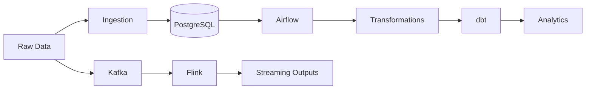

# Data Engineering Zoomcamp 2026 Portfolio


A consolidated **monorepo** documenting my work through the **DataTalksClub Data Engineering Zoomcamp 2026**. This repository combines weekly assignments, workshops, notes, and experiments into a single project intended to demonstrate practical data engineering skills and infrastructure knowledge.

---

# Objectives

- Build production-style batch and streaming pipelines.
- Learn modern data engineering tooling through hands-on labs.
- Develop reproducible local environments using Docker.
- Practice orchestration, analytics engineering, distributed processing and streaming.

---

# Repository Structure

```text
.
├── week0/
├── week1/
├── week2/
├── week3/
├── week5/
├── week6/
├── week7/
├── dlt_ai_workshop/
├── workshop_streaming/
└── README.md
```

## Module Overview

| Folder | Main Topic | Technologies |
|---|---|---|
| week0 | Environment setup | Docker, Python |
| week1 | Docker & ingestion | Docker, PostgreSQL, Python |
| week2 | Workflow orchestration | Airflow |
| week3 | Batch processing | Airflow, SQL |
| week5 | Analytics Engineering | dbt |
| week6 | Distributed processing | Apache Spark |
| week7 | Stream processing | Kafka, Apache Flink |
| dlt_ai_workshop | dlt workshop | dlt |
| workshop_streaming | Extra streaming workshop | Flink |

---

# Skills Demonstrated

- SQL
- Python
- Docker & Docker Compose
- Git & GitHub
- PostgreSQL
- Workflow orchestration
- ELT / ETL
- Data modeling
- Analytics engineering
- Apache Spark
- Kafka
- Apache Flink

---

# Architecture



---

# Working with the Repository

Clone:

```bash
git clone https://github.com/flyer123/DE_zoomcamp_2026.git
cd DE_zoomcamp_2026
```

Each module is self-contained. Follow the README inside each directory.

Typical workflow:

```bash
cd week3
docker compose up --build
```

---

# Progress

| Module | Status |
|---|---|
| Week 0 | ✅ |
| Week 1 | ✅ |
| Week 2 | ✅ |
| Week 3 | ✅ |
| Week 5 | ✅ |
| Week 6 | ✅ |
| Week 7 | ✅ |
| Workshops | ✅ |

---

# Learning Philosophy

The focus of this repository is not only completing course assignments, but also:

- writing maintainable code
- documenting implementation decisions
- building reproducible environments
- understanding trade-offs between technologies
- experimenting beyond the course material

---

# References

- DataTalksClub Data Engineering Zoomcamp 2026
- Official course materials
- Individual module documentation inside each folder

---

# Future Improvements

- CI/CD with GitHub Actions
- Infrastructure as Code
- Data quality validation
- Monitoring
- Cloud deployment
- End-to-end capstone

---

# License

This repository is intended for educational and portfolio purposes. Original course materials remain the property of their respective authors.
